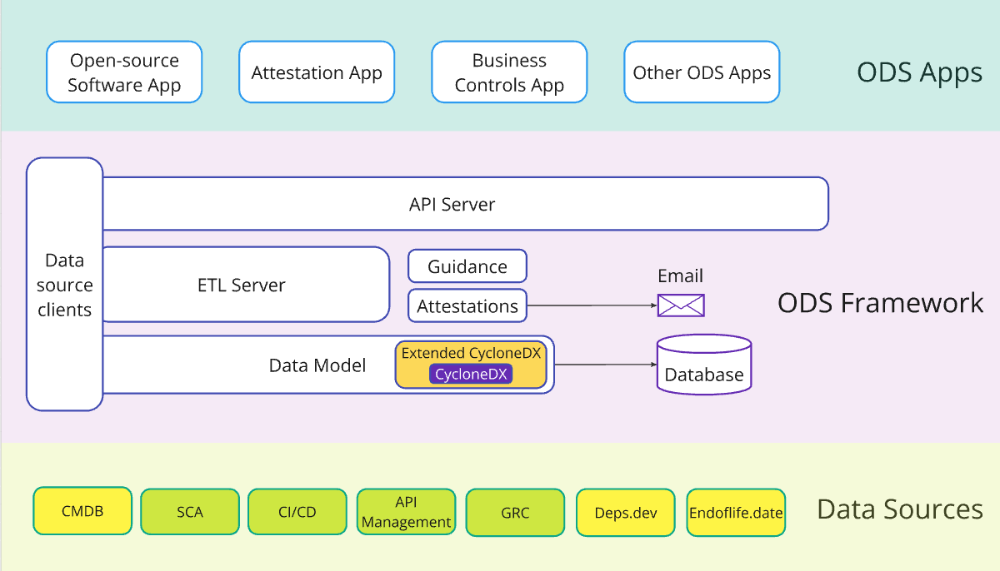

# ODS Documentation

## Overview

The **ODS Framework** is a powerful framework that provides an architecture and model for implementing an **Operational Data Store** or **ODS**.  It stores enterprise operational data from different systems of record using an industry standard [CycloneDX SBOM](https://cyclonedx.org/docs/1.6/json/) data model in a MongoDB database.  

The framework defines an architecture that utilizes data clients to extract data from the sysetms of record in your enterprise or from the broader community and aggregate with other data to create a more complete view of a software product.  The data clients can optionally cache data in MongoDB to improve performance for aggregation and query operations.

The architecture for the ODS Framework is show below.

The **ODS Framework** consists of an **ETL Server** (Extract-Transform-Load) that periodically retrieves data from the **Data Source Clients** and updates the ODS **Data Model**.  The data comes from various systems of record in the enterprise such as a Configuration Management Database (CMDB), Software Composition Analysis (SCA), etc.  

Data can also come from community sources such as Deps.dev for open-source software (OSS) library information and OpenSSF scorecards, and Endoflife.date for end of life information.  By using this additional information, disposition around version updating can be applied to help proactively manage software that consumes OSS.

The **Guidance** processor applies policies such as what OSS libraries are 2 versions below the most recent version that are potential candidates for update.

The **API Server** provides an API that can be used by **ODS Apps** that query ODS data for dashboards or report generation.

This documentation provides a guide to using ODS App, which is an example of an Open-source Software App indicated in the architecture drawing.  Included in this guide are installation instructions, feature overviews, and best practices.

## Getting Started

Refer to the following guides for installation, setup, and usage instructions.

* [Developer's Guide](./DEV_GUIDE.md)
* [User Guide](./guides/User.md)
* [Notebooks](./guides/Notebooks.md)
* [Scripts](./guides/Scripts.md)
* [Guidance](./guides/Guidance.md)
* [Sandbox](./guides/Sandbox.md)
* [ETL (Extract, Transform, Load)](./guides/ETL.md)
* [End of Life](./guides/Endoflife.md)