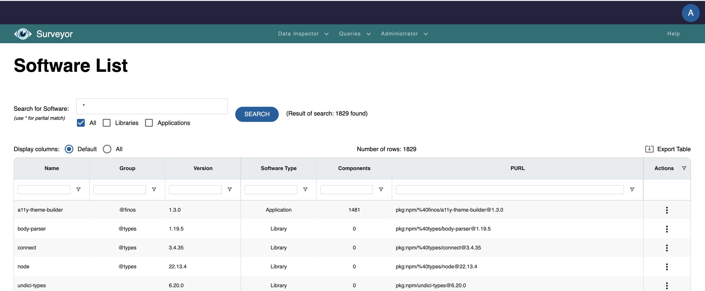
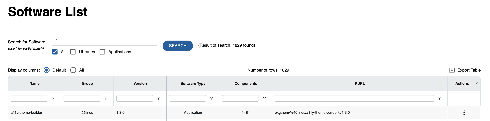
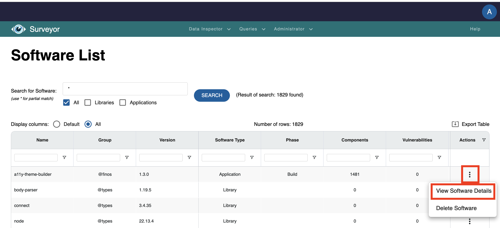
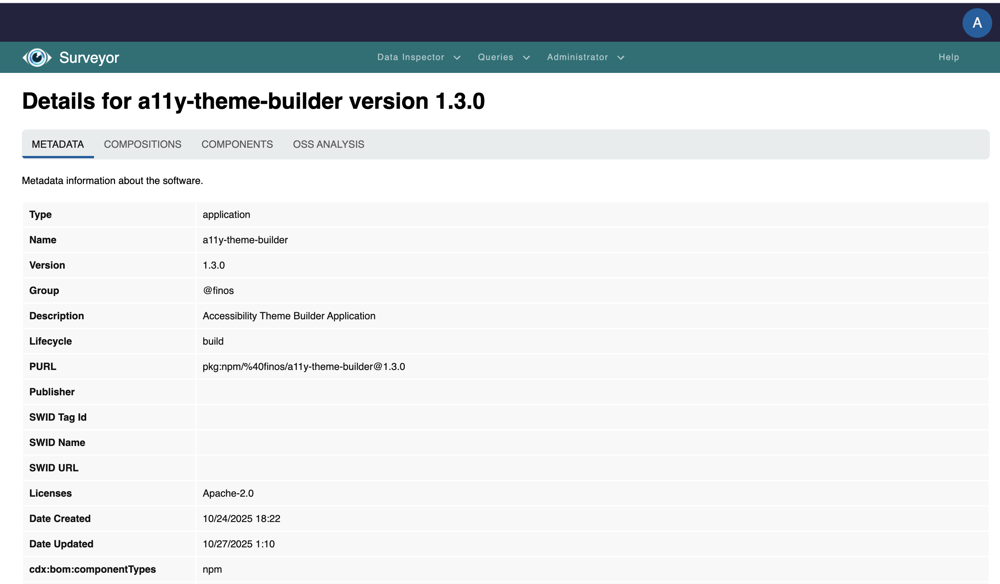
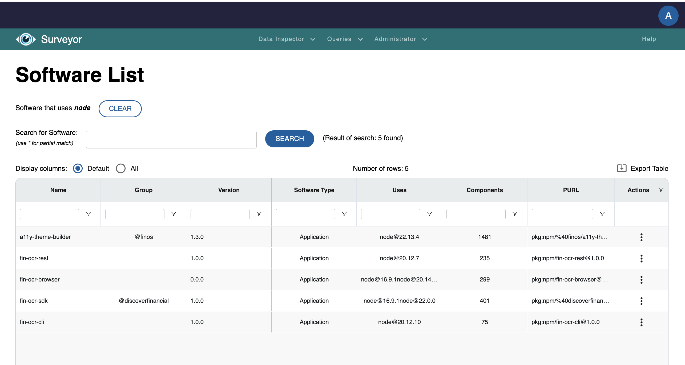
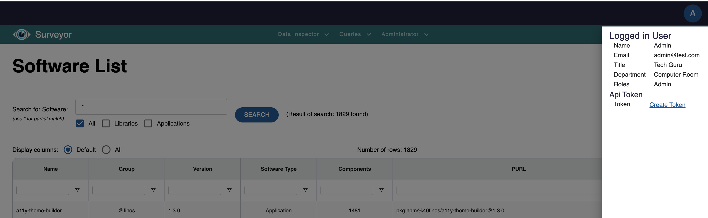
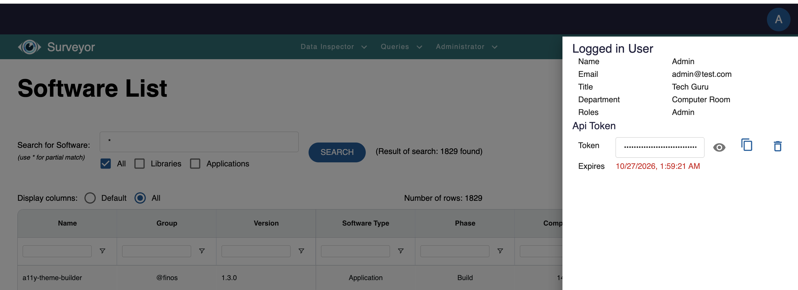

# ODS App User Guide

This is the User Guide for the ODS App application.  It will explain the features available in the UI.  Because the user interface is built with many of the same React components as other applications in the ODS Family, they will have many of the same capabilities in common.

## Navigating the UI

### Dashboard

When the ODS App is loaded, the default landing page is the dashboard.  By default, the dashboard will be loaded with an asterisk in the search bar and with the "All" filtering checkbox selected.  With that configuration, the application will present to the user the complete list of SBOMs available in the ODS Server, regardless of type, that are accessible using the current user's credentials.

By default only a subset of the available column data is visible to the user to prevent the user from being overwhelmed by a table with a lot of columns.  In order to see all of the available column data, select the **All** radio button at the top of the table.

As you'll come to notice, one nice feature of the dashboard is that changes that you make to the dashboard (e.g. changing the table radio buttons from **Default** to **All**) will be remembered across page loads.

### Search Bar

One of the key components of the dashboard is the search bar.  It appears toward the top of the dashboard.

The user is allowed to enter search terms that can be used to filter the SBOMs that will be used to fill the list.  For example, *parser* will find all of the SBOMs whose metadata.component.name property contains "parser" and populate the data grid with this set of documents.

The list of SBOMs can be further filtered by selecting one or more of the checkboxes under the search bar.  This will restrict contents of the data grid to those SBOMs that match the name filter AND whose metadata.component.type property value matches at least one of the selected checkboxes.

#### Further Filtering

The data grid allows you to sort column data in ascending or descending order by clicking on the appropriate column header.  You may further filter and sort the data in the list by using the fields that appear under the column headers.

### Export Table

When you have populated and sorted the result table with the set of SBOMs that you are interested in and achieved your desired layout, you may find it beneficial to download the table data in order to load the data in other tools.  By clicking on the **Export Table** action on the table, shown here, the data will be downloaded to the Downloads list in your browser.

The file will be in CSV format, retaining the row ordering visible in the table at the time of the export.  All available column data will be contained in the CSV file.

### Action Menu

The data grid in the dashboard allows for a limited number of actions that can be performed on the SBOM document.  By clicking on a row's vertical ellipsis in the Actions column, you will be presented with a popup menu of choices available to you.

#### For Application

There are only a few actions that can be performed on an application.  You can see details about the application and, if you are an admin, you may delete the application's SBOM from the data store.

If you click on the **View Software Details** menuitem on an application as portrayed here:

you will navigate to a page that displays some of the values of the properties that comprise the selected SBOM, as shown here:

Because these are the details of an application, tabs are available that will also provide information on the application's components/dependencies (**Components tab**) as well as a view (**OSS Analysis tab**) that collects a variety of information points on each dependency such as version, recommended version, publication date, etc.

#### For Library

If you display the action menu of a library in the table as shown here:

you will see quite a few more options.  In addition to being able to view details about this library, you'll be able to discover:
* other versions of this library that are in use in the applications collected in the data store
* applications that use this same version of the library
* applications that use any version of this library

If you select **View software that uses any version** on Node as depicted above, you will be presented with the list of all applications that have the Node library as a dependency.

As you might imagine, in an enterprise with many applications, this type of view could be incredibly useful when trying to determine who uses a library with a prominent vulnerability.

### Profile Menu

In the ODS Client app, the user's profile menu shows various pieces of information about the currently logged-in user.  This is the easiest method to determine a user's role in the application.

You'll notice that on this menu you will have the ability to create a user token.  This token may be used in place of a password when providing your credentials to invoke API's on this ODS Server.  By default its expiration date will be one year in the future.

## Summary

The UI of the ODS App shows many of the features available in an ODS Server.  While ODS App is meant to be a minimal application compared to [ODS Surveyor](https://github.com/discoverfinancial/ods-surveyor), it is still feature rich.  It is meant to give you a taste of what is possible without being overwhelming as well as being the starting point upon which another, more elaborate ODS application could be built.

If this is of interest to you, please [reach out to our community](../../../README.md#learn-more-give-feedback) to discuss your goals. 