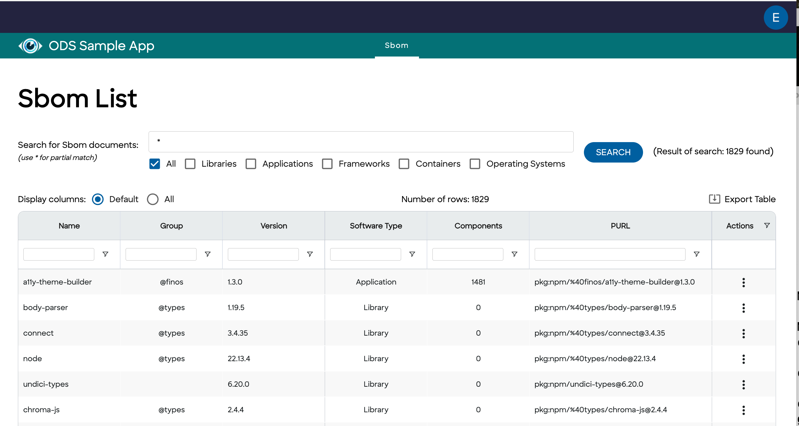
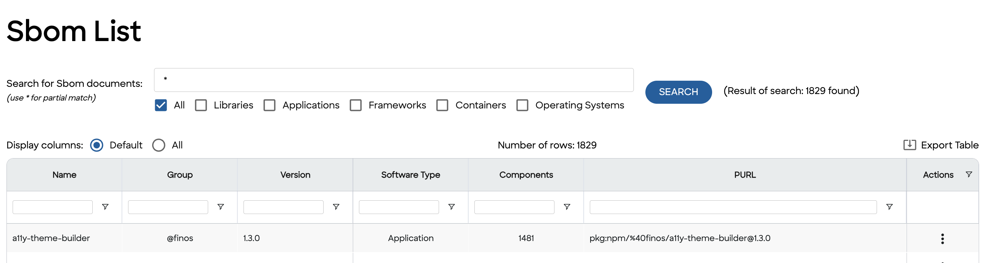
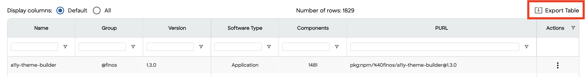
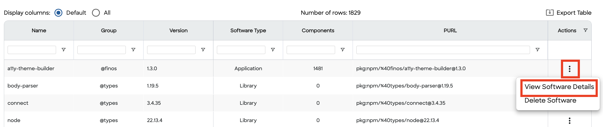
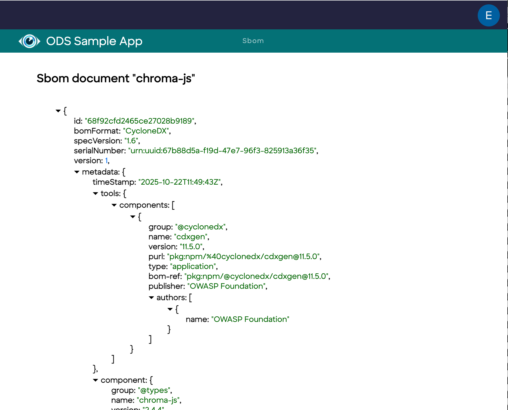
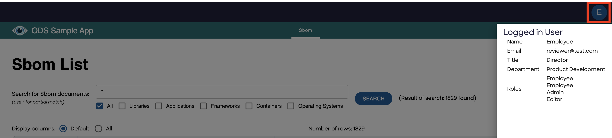

# ODS Client User Guide

This is the User Guide for the ODS Client application.  It will explain the features available in the UI.  Because the user interface is built with many of the same React components as other applications in the ODS Family, they will have many of the same capabilities in common.

## Navigating the UI

### Dashboard

When the ODS Client is loaded, the default landing page is the dashboard.  By default, the dashboard will be loaded with an asterisk in the search bar and with the "All" filtering checkbox selected.  With that configuration, the application will present to the user the complete list of SBOMs available in the ODS Server, regardless of type, that are accessible using the ODS_SERVER credentials.

By default only a subset of the available column data is visible to the user to prevent the user from being overwhelmed by a table with a lot of columns.  In order to see all of the available column data, select the **All** radio button at the top of the table.

As you'll come to notice, one nice feature of the dashboard is that changes that you make to the dashboard (e.g. changing the table radio buttons from **Default** to **All**) will be remembered across page loads.

### Search Bar

One of the key components of the dashboard is the search bar.  It appears toward the top of the dashboard.

The user is allowed to enter search terms that can be used to filter the SBOMs that will be used to fill the list.  For example, *parser* will find all of the SBOMs whose metadata.component.name property contains "parser" and populate the data grid with this set of documents.

The list of SBOMs can be further filtered by selecting one or more of the checkboxes under the search bar.  This will restrict contents of the data grid to those SBOMs that match the name filter AND whose metadata.component.type property value matches at least one of the selected checkboxes.

#### Further Filtering

The data grid allows you to sort column data in ascending or descending order by clicking on the appropriate column header.  You may further filter and sort the data in the list by using the fields that appear under the column headers.

### Export Table

When you have populated and sorted the result table with the set of SBOMs that you are interested in and achieved your desired layout, you may find it beneficial to download the table data in order to load the data in other tools.  By clicking on the **Export Table** action on the table, shown here, the data will be downloaded to the Downloads list in your browser.

The file will be in CSV format, retaining the row ordering visible in the table at the time of the export.  All available column data will be contained in the CSV file.

### Action Menu

The data grid in the dashboard allows for a limited number of actions that can be performed on the SBOM document on the ODS Server.  By clicking on a row's vertical ellipsis in the Actions column, you will be presented with a popup menu of choices available to you.  For example, you could click on the **View Software Details** menuitem as portrayed here:

If you click on this menuitem, you'll navigate to a page that displays a tree view of the properties that comprise the selected SBOM.

### Profile Menu

In the ODS Client app, the user's profile menu shows various pieces of information about the currently logged-in user.  This is the easiest method to determine a user's role in the application.

## Summary

The UI of the ODS Client is very limited in nature on purpose.  It is meant to give you a taste of what is possible without being overwhelming as well as being the starting point upon which another, more elaborate ODS client application could be built.

If this is of interest to you, please [reach out to our community](../../../README.md#learn-more-give-feedback) to discuss your goals. 